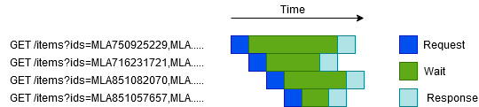
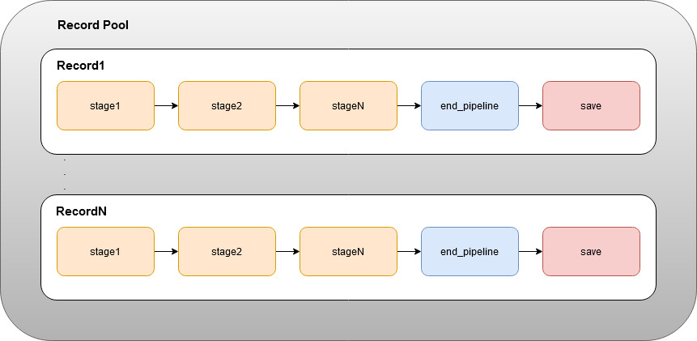

# BI ML Technical Challenge

## Quick Start

Los contenedores exponen los puertos 5000 para flask y 5432 para la base de datos postgres

Para levantar el proyecto con docker-compose, en la raíz del proyecto:

```
docker-compose up -d
```

Abrir [upload.html](upload.html) y subir el csv, si todo va bien el servidor nos va a responder con el id del upload, con ese id, por ejemplo 1, podemos ir a [http://localhost:5000/uploadstatus/1](http://localhost:5000/uploadstatus/1)
 nos va a mostrar el estado del proceso.
 
## Decisiones de diseño

El proyecto está hecho con varios contenedores docker:

- app flask
- postgres
- rabbitmq
- celery worker

### Dependencias

- flask
- flask-sqlalchemy
- python-dotenv
- psycopg2
- aiohttp
- celery

Se decidió utilizar celery y rabbitmq para correr la tarea en background y no dejar abierto el request del usuario que sube el archivo.

### Abstracción de la API de ML

En el módulo HTTPApi, se diseñó una abstracción para poder consultar al backend de Meli, se pensó en una clase Endpoint en donde cada uno tiene su propio caché, donde se guardan los resultados de las consultas.
Para el endpoint de items se aprovechó el multiget de 20 items simultaneos para optimizar las consultas.
Se utiliza un semáforo configurable para evitar sobrecargar los recursos de red del sistema operativo y/o ser limitados por el backend.

### Módulo filereader

Se diseñaron los parsers para diferentes tipos de archivos (CSV, JsonLines, txt) se cargan en runtime mediante el patrón factory

```
parser_factory = StreamParserFactory(delimiter=Config.DELIMITER)
parser_factory.register_parser('csv', CsvParser)
parser_factory.register_parser('jsonl', JsonLinesParser)
parser_factory.register_parser('txt', TxtParser)
```

La clase FileReader se construye con un objeto StreamParserFactory, una subclase Record y un nombre de archivo, se definen métodos para leer el archivo indicado linea a linea y para borrarlo.
Utiliza los parsers para parsear y construír un Record con cada una.

Cada parser implementa dos métodos por herencia:

- reader(file_object): se encarga de parsear una linea del archivo, es un generador, para csv, adapta csv.reader
- build_record(values, record_class): devuelve un Record con los valores y la clase que hereda de Record que le pasamos

En la carpeta tests se encuentran algunos tests unitarios de los parsers

#### Submódulo record

El proceso se pensó como un pipeline por etapas, en cada etapa se pueden hacer consultas a la API de mercadolibre mediante las abstracciones diseñadas para tal fin, es importante remarcar que el resultado de la consulta siempre va a estar disponible una etapa mas tarde en la caché del endpoint, esto permite agrupar las consultas del mismo tipo para todos los records para poder hacer los pedidos a la api de manera asincrónica, logrando una aceleración importante.

De manera mas gráfica, los requests de una etapa que consulta items, podría verse de esta manera sobre una linea de tiempo



#### Record 

Es la clase base para un record, es lo que usamos para modelar nuestro pipeline, se construye con los datos que nos entrega el Parser

Por ejemplo, para el ejercicio, en la clase SiteIdPriceStartTimeNameDescriptionNicknameRecord creamos dos métodos que representan dos etapas:
 
 - retrieve_item 
 - retrieve_all_details 
 
estos métodos deben retornar una lista con todos los resultados de MLApi.Endpoint.get():
 
 ```
     def retrieve_item(self, ml_api: MLApi) -> List[Tuple] or None:
        if not self._id_valid() or not self._site_valid():
            self.cancel_pipeline()
            return

        item_async = ml_api.items.get(item_id=self._item_id(),
                                      extra_args='attributes=price,start_time,currency_id,category_id,seller_id')
        return [item_async]
 ```
Dicha lista va a ser utilizada por el RecordPool para unificar todas las consultas.

Si se necesita interrumpir la ejecución en alguna etapa, se llama a cancel_pipeline() y se retorna.

En la etapa siguiente, se puede leer el resultado de dicha consulta con get_from_cache():
 
```
    def retrieve_all_details(self, ml_api: MLApi) -> List[Tuple] or None:
        item = ml_api.items.get_from_cache(item_id=self._item_id())
        ....
```

Para cargar los métodos que creamos como etapas, lo indicamos en el atributo tasks_pipeline:

```
self.tasks_pipeline = self.retrieve_item, self.retrieve_all_details
```

Luego, como siempre tenemos end_pipeline y save donde se guardan los datos en BD.

#### RecordPool 

Es una clase que agrupa los records y tiene los métodos para correr todos los pipelines y guardar todos los resultados en BD.
Tiene un tamaño determinado por configuración para manejar una cantidad fija de Records a la vez para no agotar la memoria del SO.



El método main_loop(file_reader) toma como parámetro una instancia de FileReader y se encarga de cargar los records en el pool, para cada record correr su pipeline, guardar los datos en BD y purgar todas las caches de los endpoints.

### Flask app

En el módulo fileupload se encuentra la app de flask. En su __init__ se construyen los parsers, el objeto de SQLAlchemy, el objeto celery y la app flask.

#### models

Aquí definimos los modelos para la base de datos

#### tasks

Aquí se define la tarea de celery, se utilizan todas las abstracciones construídas (MLApi, FileReader, RecordPool) para leer el archivo de disco, parsearlo, llenar el RecordPool y correr todo.
Se decidió hacerlo de esta manera con la idea de poder correr este proceso pesado en background, posibilitando también tener varios workers donde correrlo, además permite finalizar el request una vez que se sube el archivo al servidor.

#### routes

Acá se definen las dos rutas que componen la app, /uploadfile para subir el archivo y /uploadstatus/<upload_id> para poder consultar el estado de un proceso

### Configuración

Se hace mediante un archivo .env en la raíz del proyecto, por practicidad ya se provee uno en el repositorio.

#### Variables

#### POSTGRES_USER

Es el usuario que se va a utilizar para conectarse a la BD PostgreSQL

#### POSTGRES_PASSWORD

Es la contraseña que se va a utilizar para conectarse a la BD PostgreSQL

#### POSTGRES_DB

El nombre de la BD que se utilizará para la app

#### FILE_PATH

Ruta dentro del servidor donde se suben los archivos

#### FILE_TYPE

Tipo de archivo que se va a subir en el endpoint (csv, jsonl o txt)

#### DELIMITER

Delimitador que se utilizará para separar csv o txt, no se utiliza para jsonl

#### FLASK_APP

Módulo que contiene el proyecto de flask

#### FLASK_ENV

Indica que tipo de entorno se utilizará para flask (development o production)

#### RECORD_POOL_SIZE

Cuantos records procesar al mismo tiempo, elegir una cantidad razonable para no tener problemas de memoria

#### ASYNC_REQUESTS_SEMAPHORE

Semáforo contador para limitar el acceso a recursos de red del servidor al hacer requests asincrónicos.
En la config de ejemplo se configura en 1000, según el valor podrían presentarse problemas en los workers donde correrán las tareas.

#### SQLALCHEMY_DATABASE_URI

Variable de entorno de SQLAlchemy, URI a la BD postgres

#### CELERY_RESULT_BACKEND

URI al message broker

#### CELERY_BROKER_URL

URI al message broker